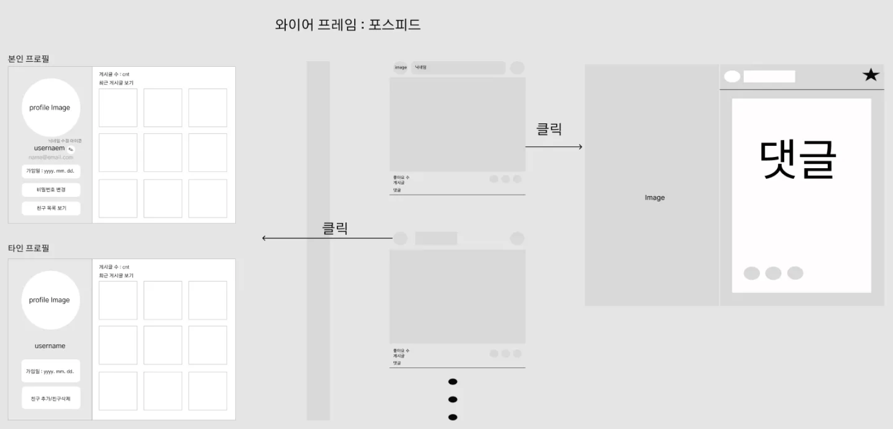
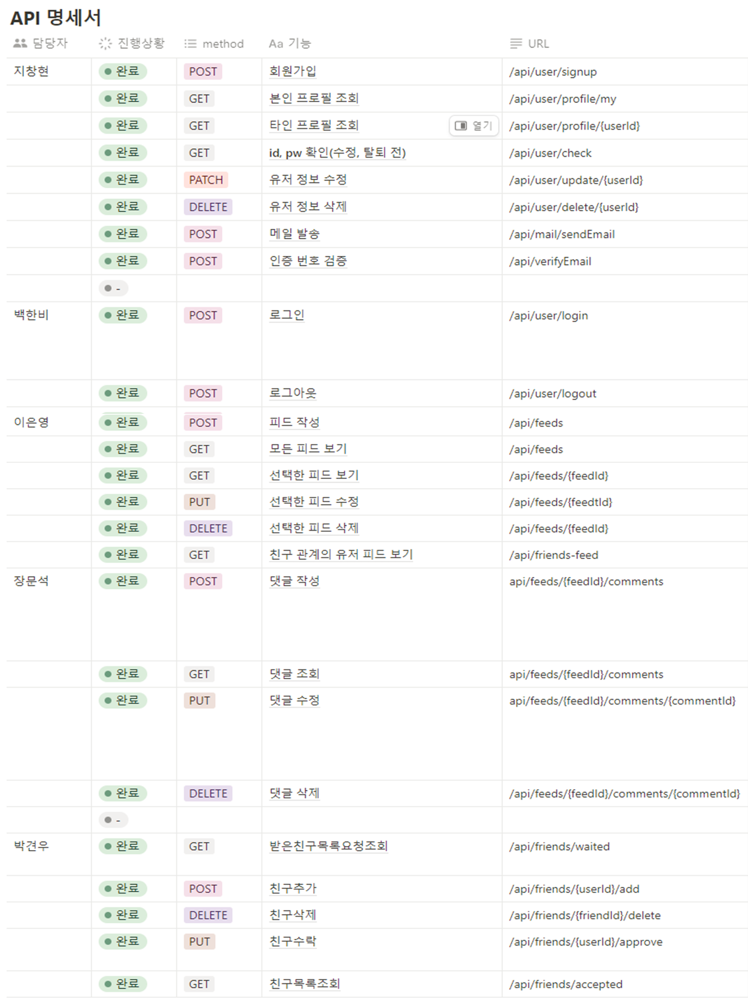
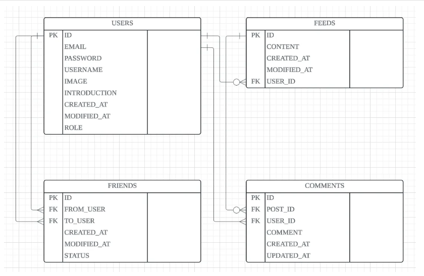

# <4조>의 newsfeed-project

## 1. 4조 소개 및 파트 소개
### 팀장 : 장문석(COMMENT)
### 팀원 :   박견우(FRIENDSHIP), 
### 지창현(USERS),
### 이은영(FEEDS), 
### 백한비(CERTIFICATION/AUTHORIZATION)
 

## 2. WIRE FRAME

 
 

## 3. API 명세서

 
 

## 4. ERD DIAGRAM

 
 

## 5. 주요 기능 소개
### - PROFILE CRUD 기능 구현
### - 회원가입 기능 구현 (가입시 인증 E_MAIL 발송)
### - LOGIN 기능 구현
### - FEED CRUD 기능 구현
### - COMMETN CRUD 기능 구현
### - FRIEND CRUD 기능 구현
 

## 6. 팀프로젝트를 하면서 느낀부분
### - 팀원들간 기본 설계를 긴 시간이 소비되더라도 탄탄히 할 것!
### - 팀원들간 존중과 많은 소통이 중요!
### - 열린마음으로 팀원의 의견 반영!
 

## 7. JDK VERSION = JDK17# news-feed-For-storage
